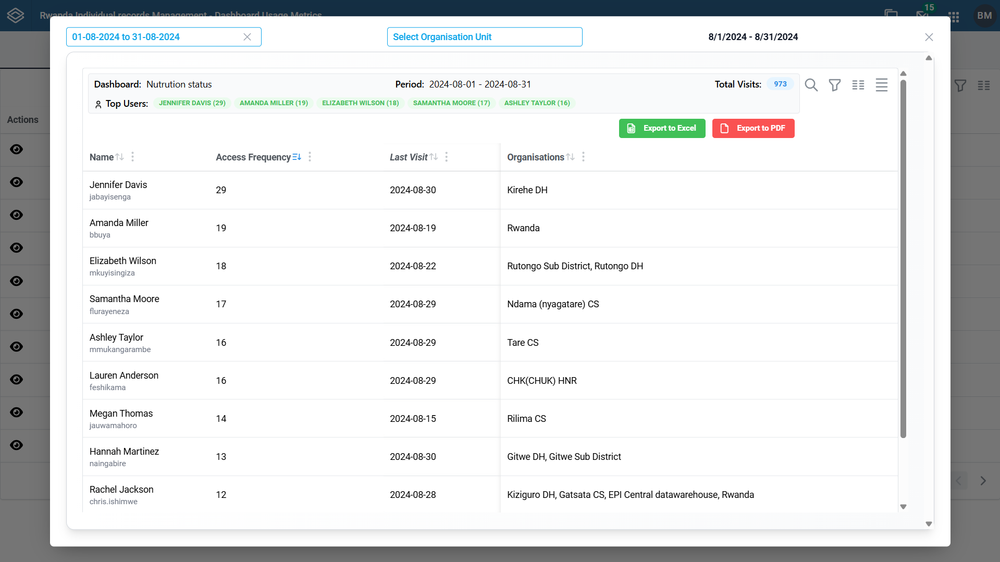
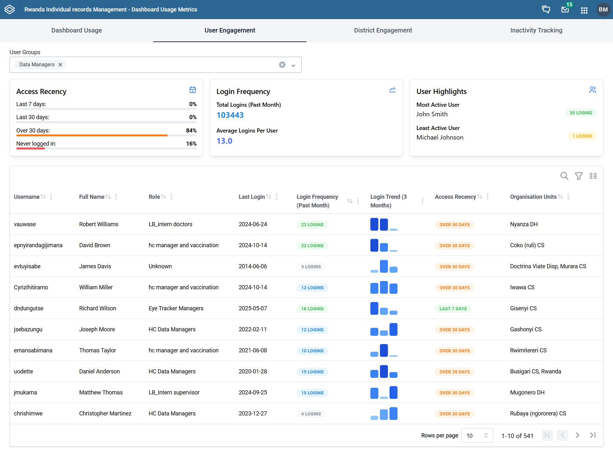
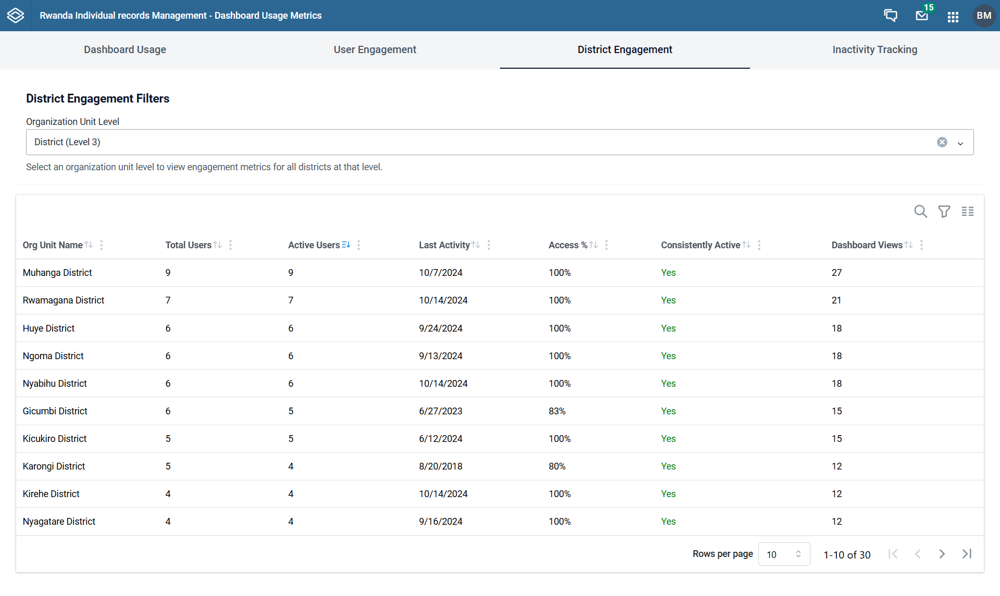
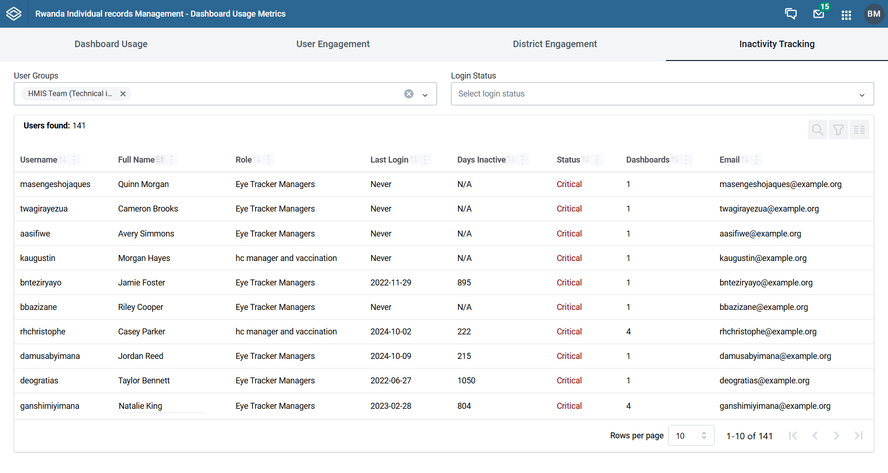
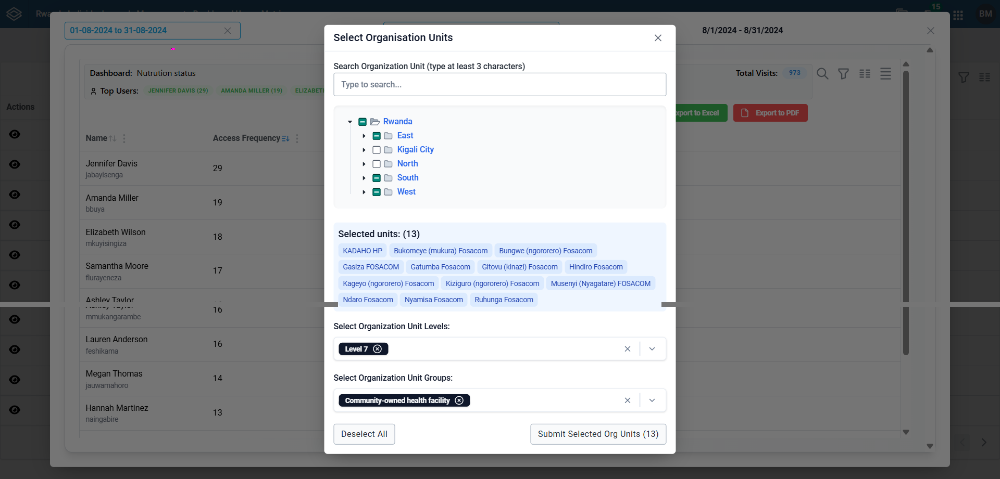

<div align="center">
  

# Dashboard Metrics App

**A DHIS2 custom application for comprehensive dashboard usage analytics and user engagement tracking**

[](https://dhis2.org/)
[](LICENSE)
[](https://github.com/hisprwanda)

</div>

---

### Contents

- [Introduction](#introduction)
- [Features](#features)
- [Screenshots](#screenshots)
- [Prerequisites](#prerequisites)
- [Getting Started](#getting-started)
- [Development](#development)
- [Building](#building)
- [Deployment](#deployment)
- [Demo Video](#demo-video)

## Introduction

The Dashboard Metrics App is a DHIS2 custom application developed by HISP Rwanda that provides analytics and tracking capabilities for dashboard usage within a DHIS2 instance. This tool helps organizations monitor and analyze how users interact with their dashboards, enabling better understanding of dashboard utilization patterns.



## Features

### 1. Dashboard Usage

- **Dashboard List**: View a comprehensive list of all dashboards.
- **Filters**
  - Time-based filtering (date range selector)
  - Organization unit-based filtering
- **Sorting**: Sort by total visits, last visit date, or top users.
- **Drill-down**: Click any dashboard to view detailed access logs for that dashboard.

### 2. User Engagement

- **User Group Selection**: Choose which user groups to analyze.
- **Access Recency Card**: Shows percentage of users who have logged in within the last 7 days, last 30 days, over 30 days ago, or never.
- **Login Frequency Card**: Displays total logins and average logins per user over the past month.
- **User Highlights**: Identifies the single most active and least active user.
- **Detailed User Table**:
  - Username & full name
  - Role
  - Last login date (past month)
  - Login frequency (past month)
  - Login trend (last 3 months)
  - Access recency category
  - Assigned organization units



### 3. District Engagement

- **Org-Unit Level Selector**: Pick the level (e.g., district, facility) for analysis.
- **District Metrics Table**:
  - Org unit name
  - Total registered users
  - Active users (≥1 login)
  - Last activity date
  - Access percentage (users who have ever logged in)
  - Consistently active districts (≥1 login/week)
  - Total dashboard views



### 4. Inactivity Tracking

- **User Group Selection**: Filter by specific user groups.
- **Inactivity Filters**:
  - Never-logged-in users
  - Users inactive for 30+ days
- **Inactivity Table**:
  - Username & full name
  - Role
  - Last login date
  - Days inactive
  - Status badge (Never / Inactive)
  - Dashboards assigned
  - Email address for follow-up



### 5. Export Capabilities

- **Excel Export**: Download any table or report as an Excel file.
- **PDF Export**: Download any table or report as a PDF document.

## Screenshots

<div align="center">

### Organization Unit Selection



### Dashboard Overview


### User Engagement Analytics


### District Engagement Metrics


### Inactivity Tracking


</div>

## Prerequisites

This project requires:

- Node.js 16.x or later
- Yarn 1.22.19 or later
- A running DHIS2 instance (v2.40+)

## Getting Started

Clone the repository and install dependencies:

```bash
git clone https://github.com/hisprwanda/dashboard-metrics
cd dashboard-metrics
yarn install
```

## Development

To start the development server:

```bash
yarn start --proxy 'https://your-dhis2-instance.org'
```

When the application starts, you will be prompted to enter:

- Username
- Password

The application will be available at [http://localhost:3000](http://localhost:3000)

> **Note:** Using the `--proxy` flag helps avoid CORS issues during development. Replace `'https://your-dhis2-instance.org'` with your actual DHIS2 instance URL.

## Building

Create a production build:

```bash
yarn build
```

The build artifacts will be available in the `build` folder, with a deployable `.zip` file in `build/bundle`.

## Deployment

Deploy the built application to a DHIS2 instance:

```bash
yarn deploy
```

You will need to provide:

- DHIS2 server URL
- Username with app-management authority
- Password

> **Note:** Be sure to run `yarn build` before deploying.

---

## Demo Video

Watch the full walkthrough of the Dashboard Metrics App in action:

<div align="center">

[](https://github.com/hisprwanda/dashboard-metrics/raw/develop/media/dashboard-usage-metrics-demo.mp4)

**👆 Click the image above to download and watch the demo video**

_A comprehensive demonstration of all features including dashboard tracking, user engagement analytics, district metrics, and inactivity monitoring._

</div>

---

## Contributing

We welcome contributions! Please feel free to submit a Pull Request. For major changes, please open an issue first to discuss what you would like to change.

## License

This project is licensed under the BSD-3-Clause License.

## Support

For questions, issues, or support:

- Open an issue on [GitHub Issues](https://github.com/hisprwanda/dashboard-metrics/issues)
- Contact HISP Rwanda

---

<div align="center">

**Developed with ❤️ by [HISP Rwanda](https://github.com/hisprwanda)**

</div>
